<h1 align="center">

  Eind project 2 API
   
</h1>

<h4 align="center">herexamen API augustus 2024</h4>

  <a href="#Wat-ik-heb-gedaan">Key Features</a> •
  <a href="#how-to-use">How To Use</a> •
  <a href="#download">Download</a> •
  <a href="#credits">Credits</a> •
  <a href="#related">Related</a> •
  <a href="#license">License</a>

## Wat ik heb gedaan
    
<h3>1. ❔ ALGEMENE EISEN & DOCUMENTATIE (alles samen +50%)</h2>
<ul>
    <li>Minstens 3 GET, 1 POST, 1 PUT en 1 DELETE endpoints</li>
    <li>Minstens 3 entiteiten in je API via een SQLite databank</li>
    <li>Minstens hashing en OAuth implementeren</li>
    <li>Beschrijving van het gekozen thema, je API(s) en je uitbreidingen + link naar de zaken die hosted zijn op GitHub README.md</li>
    <li>Aantoonbare werking totale API door screenshots van Postman requests op GitHub README.md</li>
    <li>Volledige OpenAPI docs screenshot(s) op GitHub README.md</li>
    <li>Logisch gebruik van path parameters, query parameters en body</li>
    <li>Docker container voor de API(s), welke automatisch door GitHub Actions opgebouwd wordt</li>
    <li>Aangetoond deployment van de API container(s) via Docker Compose (niet op Okteto)</li>
</ul>

<h3>2. 📳 AANVULLINGEN: FRONT-END</h2>
<h4>2.1 (+15%) Maak een front-end voor je applicatie die al je GET endpoints en POST endpoints bevat.</h3>
<ul>
    <li>2.1.1 (+10%) Host de front-end in een container die bij in je Docker Compose deployment zit.</li>
    <li>2.1.3 (+15%) Gebruik Vue, React, Angular of Svelte als JavaScript framework.</li>
</ul>
<h4>2.2 (+10%) Maak gebruik van een Grafana container om een Grafana oplossing op te zetten om je API te consumen.</h3>

## Beschrijving

Ik heb voor de onderwerp Facebook gekozen en heb 3 post en 4 get endpoints over users,posts en comments.

Ik heb ook een put en een delete over posts

ik heb ook AWS EC2 gebruikt om mijn docker container te hosten zodat ik het ook op grafan kon gebruiken. Het kan zijn dat de EC2 uitstaat maar als u het zelf wilt testen kunt u altijd een bericht sturen dan zal ik het aanzetten en dan kunt u het testen. (public ip: 44.202.149.201)

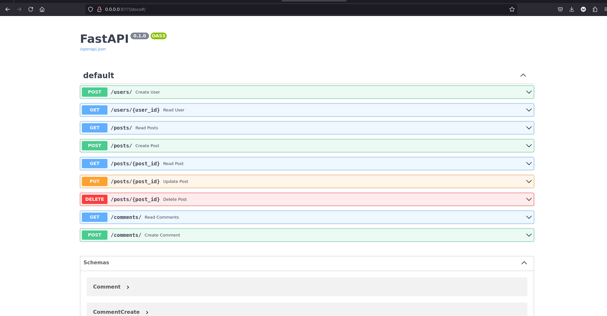

## Postman screenshot

<h3>GET user 1</h3>

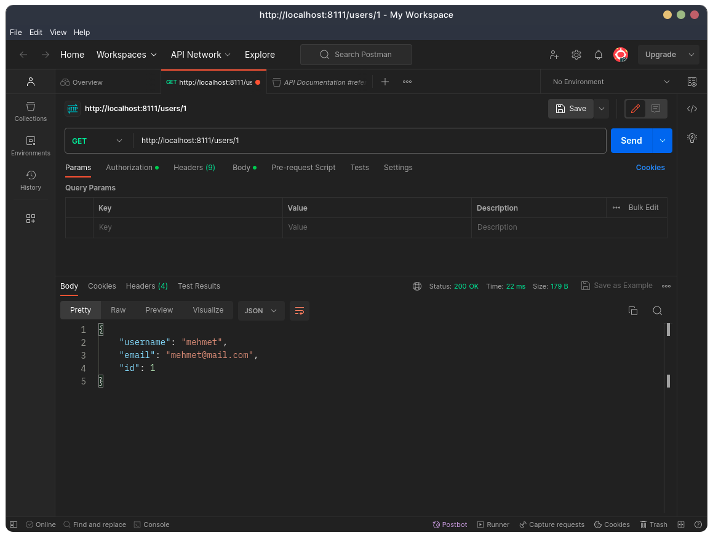

<h3>GET posts 0 - 10</h3>

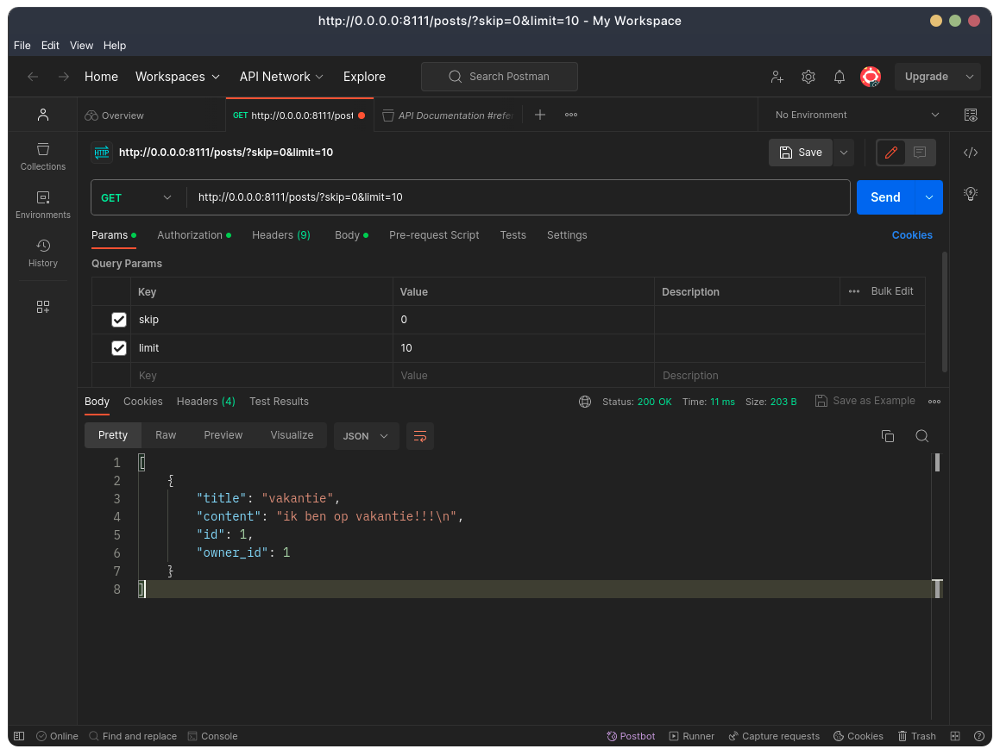

<h3>GET post id 1</h3>

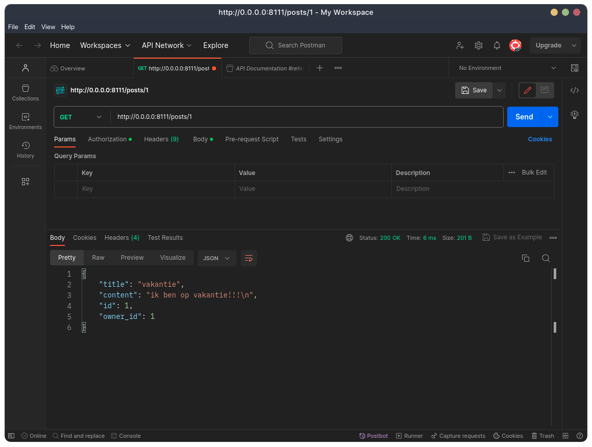

<h3>GET comments 0 - 10</h3>

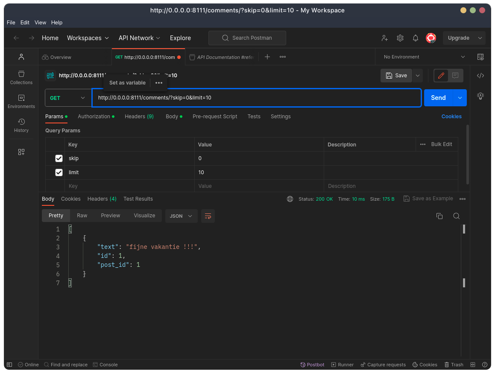

<h3>POST user</h3>

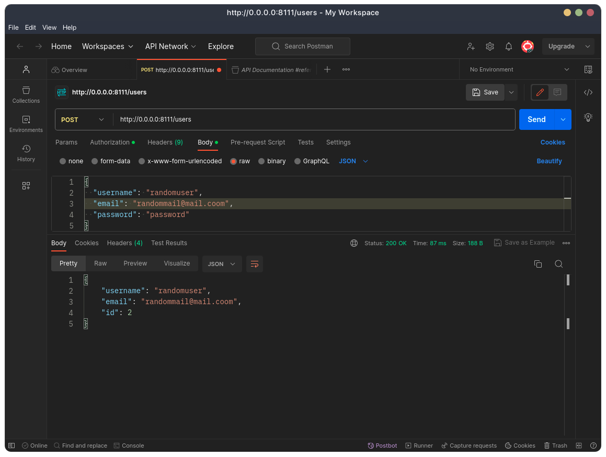

<h3>POST posts</h3>

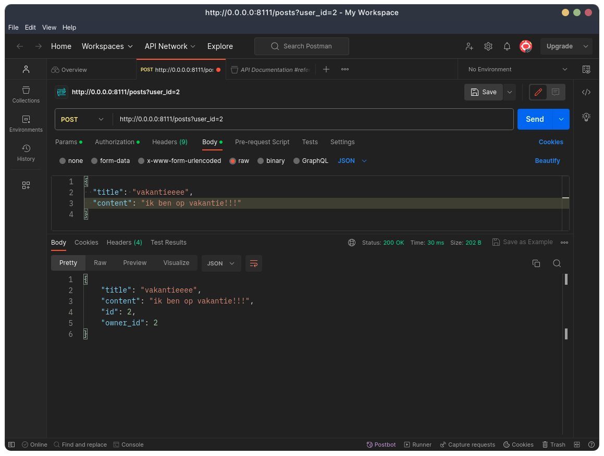

<h3>POST comments</h3>

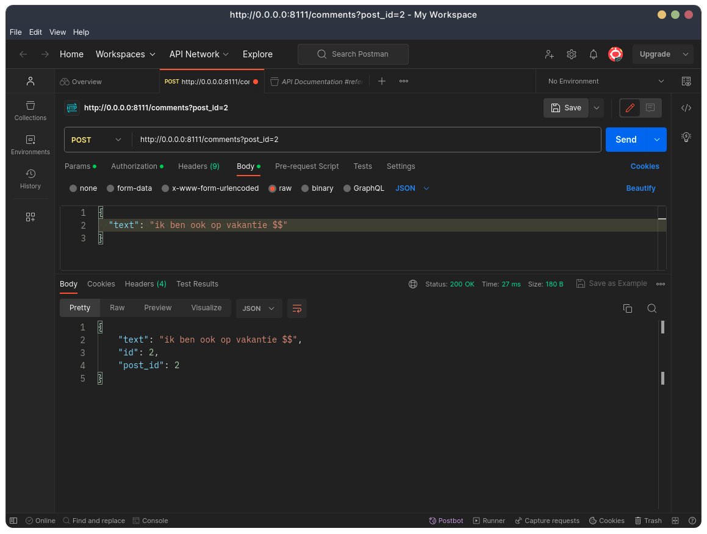

<h3>POST posts 2</h3>

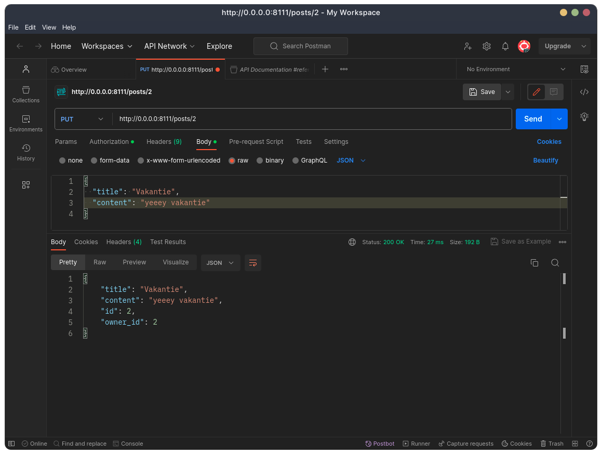

<h3>DELETE post 2</h3>

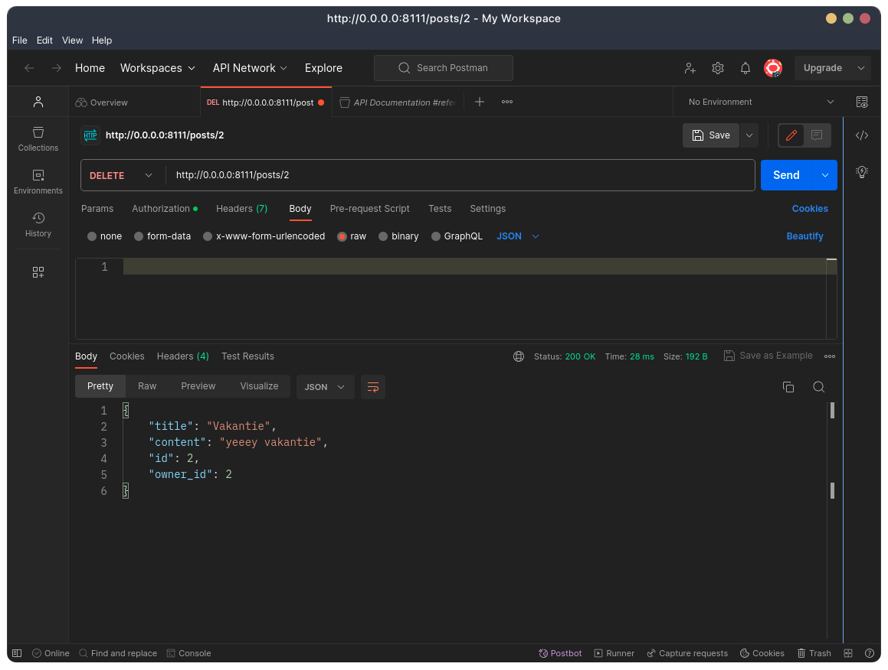

## Front end svelte GET en POST endpoints

ga naar de svelte-app directory en geef deze commands in:
"npm install","npm run build" en als laatste "npm start".

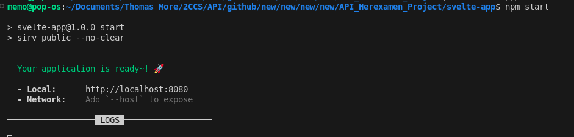

en als je naar de localhost en de port gaat zal je de svelte app moeten zien. de api fetched op localhost:8111 en dat is van de docker compose. ga naar de API_Herexamen_project en geef de command "docker compose up --build" command in het zal moeten werken. de svelte app zit ook in de docer compose maar het werkt niet en weet niet waarom

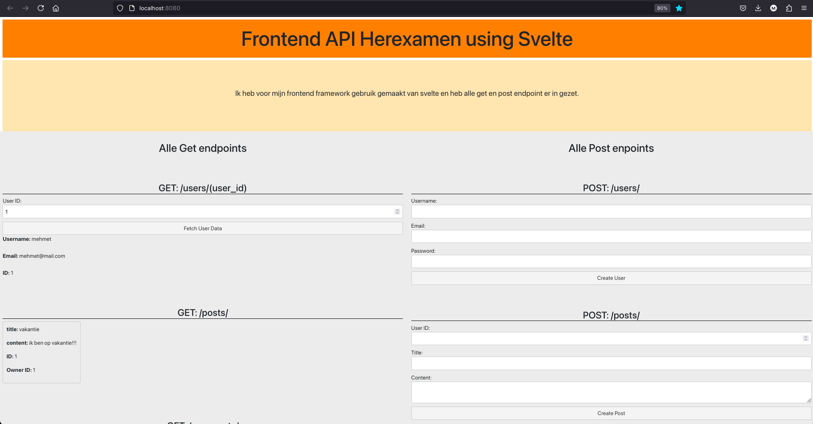

## Grafana

Ik heb mijn grafana lokaal op mijn pc staan. ik heb deze code ingegeven: "docker run -d --name=grafana -p 3000:3000 grafana/grafana"

voor grafana had ik dus aws ec2 gebruikt. ik heb daarop docker geinstalleerd daarna mijn git repo daar gecloned en "docker compose up --build" gedaan zodat ik de api op internet overal kon gebruiken.

bij grafana kon ik niet mijn api laten zien als het fastpi lokaal stond daarom dat ik de aws ec2 heb gebruikt want dat heeft een public ip address.

ik heb nieuwe connection toegevoegd genaamd infinity en daar op een nieuwe datasource en heb het gewoon fastapi genoemd.

daarna een nieuwe dashboard gemaakt daarna op "add new visualization" geklikt en daar mijn data source aangeduid in dit geval "fastapi". daarna mijn get enpoint url ingegeven en tabel gekozen

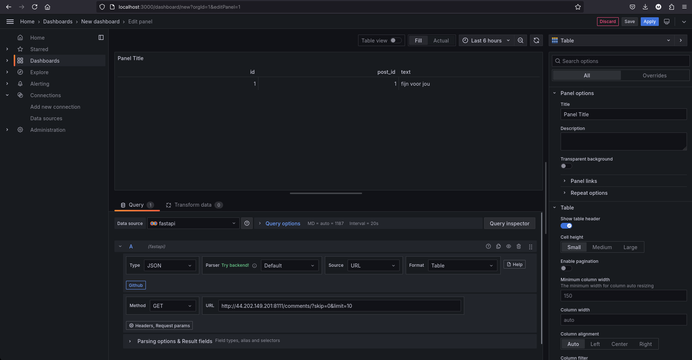

dat heb ik voor al mijn get endpoints gedaan en dit is dus hoe het er nu uitziet

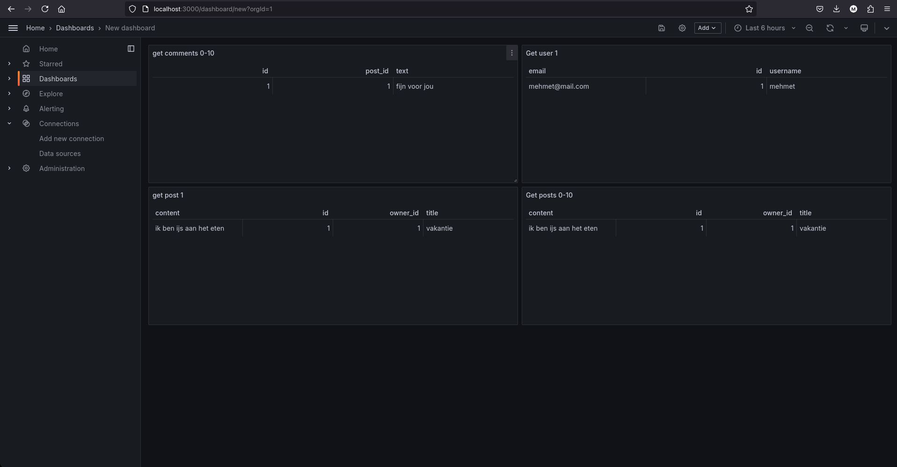

## Extra info

dit is mijn EC2 dat ik heb gebruikt:

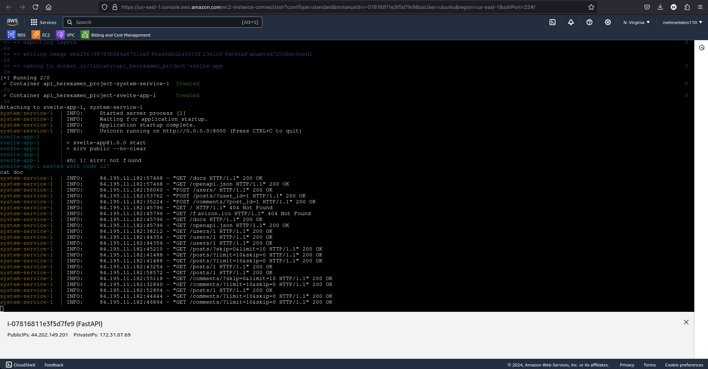

ik heb ook op mijn gitignore aangepast zodat mijn database ook in de git repo zit.

